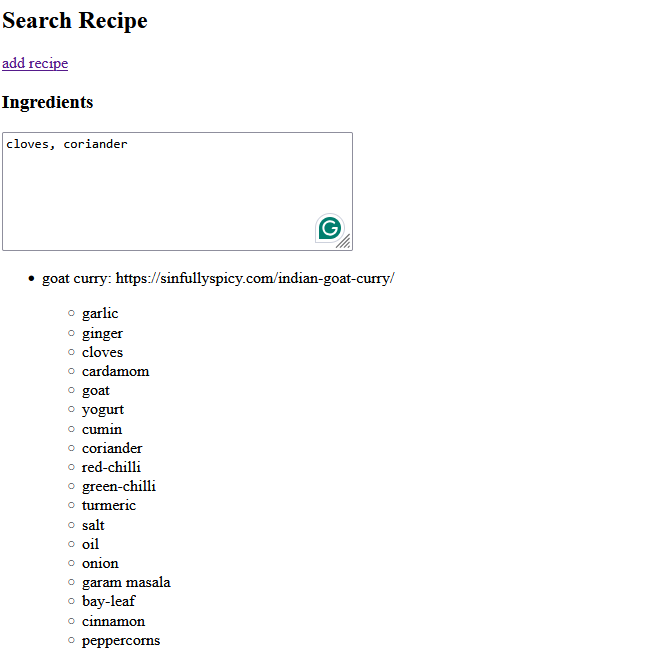

# Simple Recipe Finder

This is a super simple app that I whipped up in two days because my sister wanted a way to search for recipes  
Essentially, you can input the ingredients to a recipe as well as a description (which can store a link to the actual recipe, for instance), and then you can search for recipes in your
catalog based on what ingredients you have on hand.

## How is it Hosted

I'm running this off of AWS Amplify

# How you can host it yourself

[I might write this section at some point]
